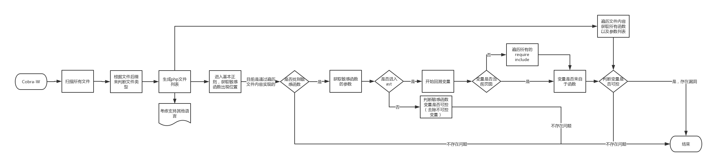

# Cobra-W

## Introduction（介绍）
Cobra是一款**源代码安全审计**工具，支持检测多种开发语言源代码中的**大部分显著**的安全问题和漏洞。
[https://github.com/wufeifei/cobra](https://github.com/wufeifei/cobra)

Cobra-W是从Cobra2.0发展而来的分支，着眼于白帽子使用的白盒审计工具，将工具重心从尽可能的发现威胁转变为提高发现漏洞的准确率以及精度。

## 特点
- Cobra-W将提高漏洞发现的准确率以及精度。
- 提供更易于从代码层面定制审计思路的规则书写方式，更易于白帽子使用。

## TODO
- <del>改写grep以及find，提供更好的底层支持</del>
- <del>去除不符合白帽子审计习惯的部分模式以及相关冗余代码</del>
- 重写rule规则方式，改为更容易针对定制的方式
- 重写AST
- ...

## 更新日志
- 2017-9-7
    - Cobra 2.0完成
    - 改写grep以及find，提供更好的底层支持
- 2017-9-7
    - Cobra-W 0.1完成
    - 去除相关冗余代码
- 2017-9-8
    - Cobra-W 0.1.1完成
    - 去除api以及cve部分代码

## 开发流程图

## Links（链接）
- [Cobra文档](https://wufeifei.github.io/cobra/)
- Cobra-W文档待完善...
