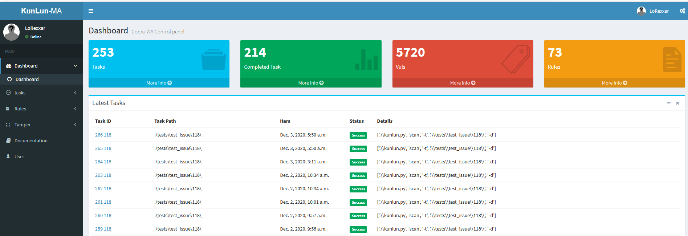
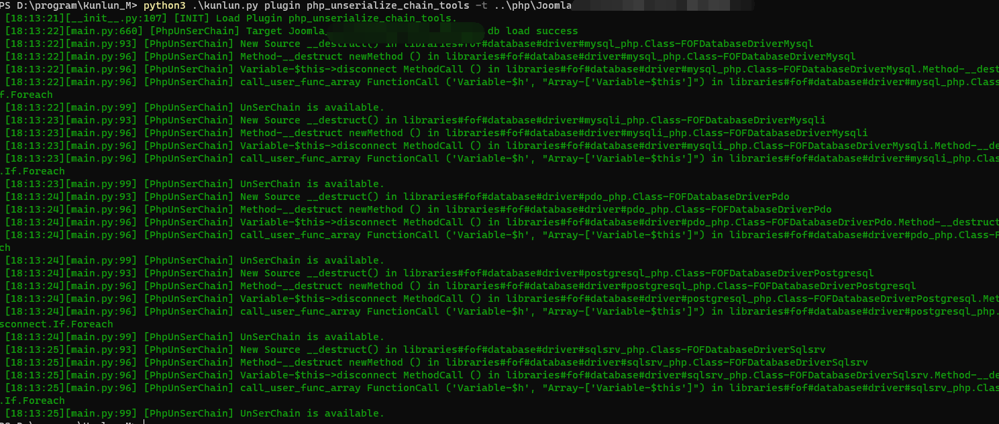
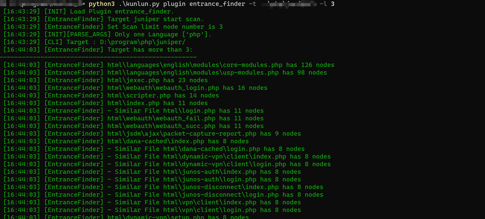

<big>**自Cobra-W 2.0版本起，Cobra-W正式更名为Kunlun-M(昆仑镜)，**</big>

**请使用python3.6+运行该工具，已停止维护python2.7环境**

# Kunlun-Mirror
[](https://github.com/LoRexxar/Cobra-W/releases)
[](https://github.com/wufeifei/cobra/blob/master/LICENSE)
[](https://travis-ci.org/LoRexxar/Cobra-W)


```
 _   __            _                      ___  ___
| | / /           | |                     |  \/  |
| |/ / _   _ _ __ | |    _   _ _ __       | .  . |
|    \| | | | '_ \| |   | | | | '_ \ _____| |\/| |
| |\  \ |_| | | | | |___| |_| | | | |_____| |  | |
\_| \_/\__,_|_| |_\_____/\__,_|_| |_|     \_|  |_/  -v2.0

GitHub: https://github.com/LoRexxar/Kunlun-M

KunLun-M is a static code analysis system that automates the detecting vulnerabilities and security issue.

Main Program

positional arguments:
  {init,config,scan,show,console}
    init                Kunlun-M init before use.
    config              config for rule&tamper
    scan                scan target path
    show                show rule&tamper
    console             enter console mode

optional arguments:
  -h, --help            show this help message and exit

Usage:
  python kunlun.py scan -t tests/vulnerabilities
  python kunlun.py scan -t tests/vulnerabilities -r 1000, 1001
  python kunlun.py scan -t tests/vulnerabilities -tp wordpress
  python kunlun.py scan -t tests/vulnerabilities -d -uc

  python kunlun.py list rule -k php
```

## Introduction
Cobra是一款**源代码安全审计**工具，支持检测多种开发语言源代码中的**大部分显著**的安全问题和漏洞。
[https://github.com/wufeifei/cobra](https://github.com/wufeifei/cobra)

Cobra-W是从Cobra2.0发展而来的分支，将工具重心从尽可能的发现威胁转变为提高发现漏洞的准确率以及精度。
[https://github.com/LoRexxar/Kunlun-M/tree/cobra-w](https://github.com/LoRexxar/Kunlun-M/tree/cobra-w)

Kunlun-Mirror是从Cobra-W2.0发展而来，在经历了痛苦的维护改进原工具之后，昆仑镜将工具的发展重心放在安全研究员的使用上，将会围绕工具化使用不断改进使用体验。

目前工具主要支持**php、javascript**的语义分析，以及**chrome ext, solidity**的基础扫描.

## Stargazers 

[](https://starchart.cc/LoRexxar/Kunlun-M)

## why KunLun-M

KunLun-M可能是市面上唯一的开源并长期维护的自动化代码审计工具，希望开源工具可以推动白盒审计的发展:>.

## 特点

与其他代码审计相比：
- 静态分析，环境依赖小。
- 语义分析，对漏洞有效性判断程度更深。
- 多种语言支持。
- 开源python实现，更易于二次开发。

与Cobra相比：
- 深度重写AST，大幅度减少漏洞误报率。
- 底层api重写，支持windows、linux等多平台。
- 多层语义解析、函数回溯，secret机制，新增多种机制应用于语义分析。
- 新增javascript语义分析，用于扫描包含js相关代码。

与Cobra-W相比(todo):
- 深度优化AST分析流程，使其更符合QL的概念，便于下一阶段的优化。
- 深度优化辅助审计的流程，使其更符合人类安全研究员审计辅助的习惯。
- 深度重构代码结构，使其更符合可拓展，可优化的开源理念。

## TODO
- <del>改写grep以及find，提供更好的底层支持</del>
- <del>去除不符合白帽子审计习惯的部分模式以及相关冗余代码</del>
- <del>重写rule规则方式</del>，改为更容易针对定制的方式（有待进一步优化）
- 重写AST
    - <del>递归回溯变量</del>
    - <del>递归回溯自定义函数</del>
    - <del>多级函数调用</del>
    - <del>自定义类调用</del>
    - 未知语法待解析
- <del>添加疑似漏洞分级，部分回溯存在问题但是不能回溯到可控变量的漏洞，通过疑似漏洞的方式展示。</del>
- <del>添加关于javascript的静态分析</del>
- 完成针对有关于javascript的多种特殊问题
    - 适配关于html中内联js的扫描
    - 添加区分前端js与nodejs功能，并为node_js添加专门的扫描
    - 未知语法待解析
- 完成关于java的静态分析
- 完善AST分析的路径记录以及分析流程，使其更符合QL的概念
- <del>添加Sqlite3作为灵活数据库用于记录以及管理扫描任务以及结果</del>
- 重构tamper部分，使其更符合人类的配置文件思路
- <del>添加console模式，使其更符合日常使用的工具逻辑</del>
- 重构rule模式，使其更符合可扩展，可编辑的概念
- 重构Cobra-WA
    - <del>添加http dashboard形式的漏洞任务管理界面</del> （短时间内不会继续做web管理界面，不符合目前对工具的定义
    - 集成到Kunlun-M中的web管理平台
    - 提供平台化的漏洞管理方案
    - 添加图关系的审计分析流程

## 社区化工具

社区成员完成的拓展（不保证安全性，参考使用）

- [Kunlun-M-GUI](https://github.com/mark0smith/Kunlun-M-GUI)
- [docker-kunlun-mirror](https://github.com/lazychanger/docker-kunlun-mirror)

## 更新日志

[changelog.md](./docs/changelog.md)


## 安装

首先需要安装依赖
```
pip install -r requirements.txt
```

配置文件迁移
```
cp Kunlun_M/settings.py.bak Kunlun_M/settings.py
```


初始化数据库，默认采用sqlite作为数据库
```
python kunlun.py init initialize
```

加载规则进数据库（每次修改规则文件都需要加载）
```
python kunlun.py config load
```

### docker安装

通过docker安装，默认启动web模式

```
sudo docker build -t kunlun-m -f ./docker/Dockerfile .
```

配合链接同Mysql可以实现本地扫描，web端查看结果。

## Usage

### cli mode

使用scan模式扫描各类源代码
```
python3 kunlun.py scan -t ./tests/vulnerabilities/
```

使用config模式加载本地的rule/tamper
```
python3 kunlun.py config load         # 加载rule进数据库
python3 kunlun.py config recover      # 将数据库中的rule恢复到文件
python3 kunlun.py config loadtamper   # 加载tamper进数据库
python3 kunlun.py config retamper     # 将数据库中的tamper恢复到文件

```

使用show模式查看目前的所有rule/tamper
```
python3 kunlun.py show rule           # 展示所有的rule
python3 kunlun.py show rule -k php    # 展示所有php的rule
python3 kunlun.py show tamper         # 展示所有的tamper
```

使用不同子模式的-h可以查看详细的帮助文档。


### web mode
KunLun-M Dashbroad，并且允许通过apitoken来访问api获取数据

默认9999端口
```
python3 .\kunlun.py web -p 9999
```



修改`KunLun-M/settings.py`中的api-token，通过?token={api_token}访问api获取数据
```
# api profile
API_TOKEN = "secret_api_token"
```

Api List
```
task/list                                       查看task列表
task/<int:task_id>                              查看task详细信息
task/<int:task_id>/result                       查看task扫描结果
task/<int:task_id>/resultflow                   查看task扫描结果流
task/<int:task_id>/newevilfunc                  查看task扫描后生成的新恶意函数

rule/list                                       查看规则列表
rule/<int:rule_id>                              查看规则细节
```

### console mode

**建议使用console模式**
```
python3 kunlun.py console


 _   __            _                      ___  ___
| | / /           | |                     |  \/  |
| |/ / _   _ _ __ | |    _   _ _ __       | .  . |
|    \| | | | '_ \| |   | | | | '_ \ _____| |\/| |
| |\  \ |_| | | | | |___| |_| | | | |_____| |  | |
\_| \_/\__,_|_| |_\_____/\__,_|_| |_|     \_|  |_/  -v2.0

GitHub: https://github.com/LoRexxar/Kunlun-M

KunLun-M is a static code analysis system that automates the detecting vulnerabilities and security issue.

Global commands:
    help                                             Print this help menu
    scan                                             Enter the scan mode
    load <scan_id>                                   Load Scan task
    showt                                            Show all Scan task list
    show [rule, tamper] <key>                        Show rules or tampers
    config [rule, tamper] <rule_id> | <tamper_name>  Config mode for rule & tamper
    exit                                             Exit KunLun-M & save Config


KunLun-M (root) >
```

#### 使用KunLun-M 查看 rules 和 tampers

[](https://asciinema.org/a/360842)

#### 使用KunLun-M 扫描漏洞

[](https://asciinema.org/a/360843)

#### 使用KunLun-M 查看扫描结果

[](https://asciinema.org/a/360845)

### plugin mode

#### phpunserializechain

一个自动化寻找php反序列化链的简单模型

**如果是旧版本更新并使用该插件扫描同一目标，请使用-r参数renew数据库**

```
python3 .\kunlun.py plugin php_unserialize_chain_tools -t {target_path}
```




#### EntranceFinder

一个有趣的小工具，用于解决在审计大量的php代码时，快速发现存在可能的入口页面（或是开发者都遗漏的）。

```
python3 .\kunlun.py plugin entrance_finder -t {target_path} -l 3
```



## 开发文档

开发文档还未更新.相应的文档内容仅供参考。

[dev.md](./docs/dev.md)

### 规则插件开发

规则插件开发遵循
```
rules/{语言类型}/CVI_xxxx.py
```

在规则目录下，只有命名符合规定的规则会被成功加载，命名格式严格为`CVI_编号.py`

规则模板可以参考rules/rule.template

### .kunlunmignore

.kunlunmignore是新引入的用于黑名单扫描目录的功能。目前只支持*语法，可以用来匹配相应的目录以及文件类型。

相匹配到的文件不会被扫描。

当然，可以通过-b来实现

## 404StarLink Project


KunLun-M 是 404Team [星链计划](https://github.com/knownsec/404StarLink-Project)中的一环，如果对KunLun-M有任何疑问又或是想要找小伙伴交流，可以参考星链计划的加群方式。

- [https://github.com/knownsec/404StarLink-Project#community](https://github.com/knownsec/404StarLink-Project#community)

## Contributors

感谢如下贡献者对本工具发展过程中的贡献：

核心开发者：


- Knownsec 404 Team [LoRexxar](https://github.com/LoRexxar)

重要贡献者：


- Vidar-Team [LuckC4t](https://github.com/LuckyC4t)


- Dubhe [Sissel](https://github.com/boke1208)

次要贡献者：
- Dubhe [Sndav](https://github.com/Sndav)
- [#jax777](https://github.com/jax777)
- [lavon321](https://github.com/lavon321)
- [Raul1718](https://github.com/Raul1718)
- [akkuman](https://github.com/akkuman)
