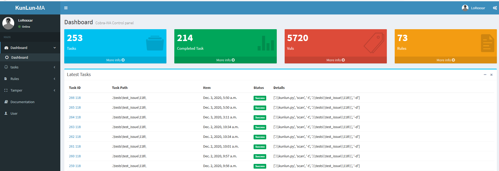
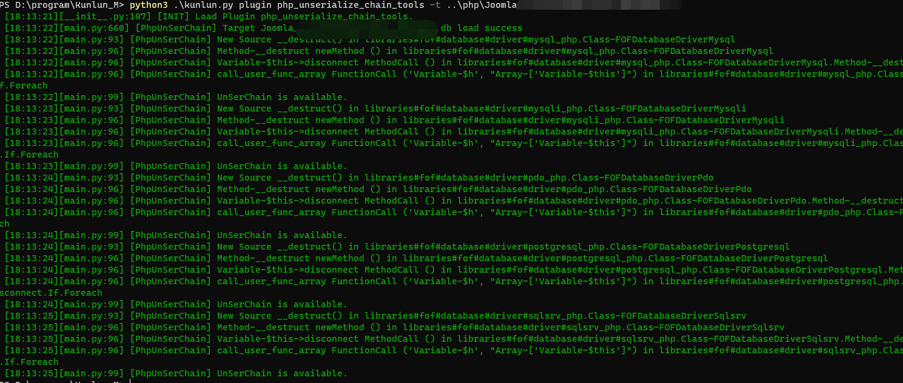
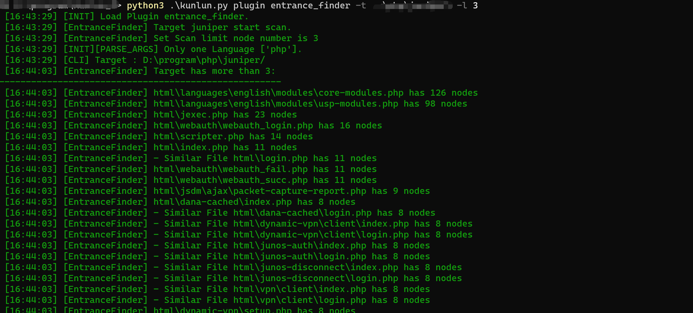

[中文](README.zh.md) | English

> <big>**Since Cobra-W 2.0, Cobra-W has been officially renamed to Kunlun-M（昆仑镜）.**</big>

> **Python 3.10+ is recommended (Python 3.13+ preferred); Python 2.7 has reached end-of-life.**

> Thanks to the AI era, I can address the project's basic maintenance issues at extremely low cost. Although the project's concepts may not be cutting-edge by today's standards, the stable core still serves as a solid tool reference. I will continue to iterate rapidly using Codex at minimal cost, boldly experiment with new features, and **attempt to build a potentially very useful tool using AI-era methods**.

# Kunlun-Mirror
[](https://github.com/LoRexxar/Kunlun-M/releases)
[](./LICENSE)


```
 _   __            _                      ___  ___
| | / /           | |                     |  \/  |
| |/ / _   _ _ __ | |    _   _ _ __       | .  . |
|    \| | | | '_ \| |   | | | | '_ \ _____| |\/| |
| |\  \ |_| | | | | |___| |_| | | | |_____| |  | |
\_| \_/\__,_|_| |_\____/\__,_|_| |_|     \_|  |_/  -v2.15.0

GitHub: https://github.com/LoRexxar/Kunlun-M

KunLun-M is a static code analysis system that automates the detecting vulnerabilities and security issue.

Main Program

positional arguments:
Core Commands
-------------
  init    Kunlun-M init before use.
  scan    scan target path
  console enter console mode
  web     KunLun-m Web mode
Other Commands
--------------
  export   export rules and tampers from database to files
  generate generate rule & tamper
  show     show rule & tamper
  search   search project by vendor/path/...
  plugin   Plugins list:
           entrance_finder                                   Quickly find the php entry page
           php_unserialize_chain_tools                       Discover the PHP deserialization chain through codedb
          

options:
  -h, --help            show this help message and exit

Usage:
  python kunlun.py init
  python kunlun.py scan -t tests/vulnerabilities
  python kunlun.py scan -t tests/vulnerabilities -r 1000, 1001
  python kunlun.py scan -t tests/vulnerabilities -tp wordpress
  python kunlun.py scan -t tests/vulnerabilities -d -uc
  python kunlun.py console
  python kunlun.py web -p 9999
```

## Introduction
Cobra is a **source code security audit** tool that supports detecting **most significant** security issues and vulnerabilities in source code written in multiple programming languages.
[https://github.com/wufeifei/cobra](https://github.com/wufeifei/cobra)

Cobra-W is a fork evolved from Cobra 2.0, shifting the tool's focus from discovering as many threats as possible to improving the accuracy and precision of vulnerability detection.
[https://github.com/LoRexxar/Kunlun-M/tree/cobra-w](https://github.com/LoRexxar/Kunlun-M/tree/cobra-w)

Kunlun-Mirror evolved from Cobra-W 2.0. After going through the painful process of maintaining and improving the original tool, Kunlun-Mirror (昆仑镜) shifts the tool's focus towards serving security researchers, continuously improving the user experience around practical tool-based usage.

The tool currently primarily supports semantic analysis for **PHP, Nodejs/JavaScript, Python, Java, Go, and C/C++**, as well as basic scanning for **Chrome extensions and Solidity**.

Built-in Skills have been added, **supporting one-click integration with AI Agents (OpenClaw / Codex / Claude Code / Hermes, etc.)** for rapid vulnerability scanning.

## Stargazers

<div align=center><a href="https://github.com/LoRexxar/Kunlun-M"></a></div>

## why KunLun-M

KunLun-M is perhaps the only open-source and actively maintained automated code audit tool on the market. We hope this open-source tool can help advance the development of white-box auditing:>.

## Changelog

[changelog.md](./docs/changelog.md)


## Installation

First, install the dependencies:
```
pip install -r requirements.txt
```

Migrate the configuration file:
```
cp Kunlun_M/settings.py.bak Kunlun_M/settings.py
```


Initialize the database (SQLite is used by default):
```
python kunlun.py init
```

### Docker Installation

Install via Docker, which starts web mode by default:

```
sudo docker build -t kunlun-m -f ./docker/Dockerfile .
```

By linking with MySQL, you can perform local scanning and view results through the web interface.

## Usage

### cli mode

Use scan mode to scan various source code:
```
python3 kunlun.py scan -t ./tests/vulnerabilities/
```

Export reports (JSON/Markdown/HTML):
```
python3 kunlun.py scan -t ./tests/vulnerabilities/ -f json -o /tmp/report.json
python3 kunlun.py scan -t ./tests/vulnerabilities/ -f md -o /tmp/report.md
python3 kunlun.py scan -t ./tests/vulnerabilities/ -f html -o /tmp/report.html
```

Use show mode to view all current rules/tampers:
```
python3 kunlun.py show rule           # Show all rules
python3 kunlun.py show rule -k php    # Show all PHP rules
python3 kunlun.py show tamper         # Show all tampers
```

Use the -h flag with any sub-command to view detailed help documentation.

### skill automation

If you are using an AI Agent (OpenClaw / Codex / Claude Code / Hermes, etc.) to run Kunlun-M, you can simply send the following message to your Agent as a "basic installation instruction":

> Download `https://github.com/LoRexxar/Kunlun-M.git` and load its skill (kunlun-m-general).

The Agent will typically automatically recognize the `skills/kunlun-m-general/` directory in the repository, and follow the documentation to complete initialization and subsequent scanning.

For a more detailed scripted workflow with test/report commands, see [docs/skill_kunlunm_general.md](./docs/skill_kunlunm_general.md).

### CI/CD scan driver

Run scans in CI/CD with gating (stable JSON reports + clear exit codes):

```
python tools/ci_scan.py --target . --output artifacts/kunlun-ci.json --fail-on high
```

For more parameters, exit codes, report structure, and GitHub Actions/GitLab CI/Jenkins examples, see [docs/ci.md](./docs/ci.md)


### web mode
KunLun-M Dashboard, with the ability to access APIs via apitoken to retrieve data.

Default port is 9999:
```
python3 .\kunlun.py web -p 9999
```



Modify `API_TOKEN` in `Kunlun_M/settings.py`, and access the API via `?apitoken=...` to retrieve data:
```
# api profile
API_TOKEN = "secret_api_token"
```

Api List
```
/api/task/list                                       View task list
/api/task/<int:task_id>                              View task details
/api/task/<int:task_id>/result                       View task scan results
/api/task/<int:task_id>/resultflow                   View task scan result flow
/api/task/<int:task_id>/newevilfunc                  View new malicious functions generated after scan

/api/rule/list                                       View rule list
/api/rule/<int:rule_id>                              View rule details
```

### console mode

**Console mode is recommended:**
```
python3 kunlun.py console


 _   __            _                      ___  ___
| | / /           | |                     |  \/  |
| |/ / _   _ _ __ | |    _   _ _ __       | .  . |
|    \| | | | '_ \| |   | | | | '_ \ _____| |\/| |
| |\  \ |_| | | | | |___| |_| | | | |_____| |  | |
\_| \_/\__,_|_| |_\____/\__,_|_| |_|     \_|  |_/  -v2.15.0

GitHub: https://github.com/LoRexxar/Kunlun-M

KunLun-M is a static code analysis system that automates the detecting vulnerabilities and security issue.

Global commands:
    help                                             Print this help menu
    scan                                             Enter the scan mode
    load <scan_id>                                   Load Scan task
    showt                                            Show all Scan task list
    show [rule, tamper] <key>                        Show rules or tampers
    config [rule, tamper] <rule_id> | <tamper_name>  Config mode for rule & tamper
    exit                                             Exit KunLun-M & save Config


KunLun-M (root) >
```

#### Using KunLun-M to view rules and tampers

[](https://asciinema.org/a/360842)

#### Using KunLun-M to scan for vulnerabilities

[](https://asciinema.org/a/360843)

#### Using KunLun-M to view scan results

[](https://asciinema.org/a/360845)


### plugin mode

#### phpunserializechain

A simple model for automatically finding PHP deserialization chains.

**If you are updating from an older version and scanning the same target, please use the -r parameter to renew the database.**

```
python3 .\kunlun.py plugin php_unserialize_chain_tools -t {target_path}
```

If the plugin identifies a complete PHP deserialization chain, it will automatically generate `.kunlunm_unserialize_poc/` in the target directory, containing the chain JSON summary, `chain_XX.php` (one PoC per chain), and the batch execution script `poc_all_chains.php`.
The generated `chain_XX.php` will preferentially use the hierarchical relationships and property information saved during the recursive scanning process to assemble the object graph; if insufficient information is available, it falls back to property path extraction and fallback relationships.
It also outputs corresponding trigger syntax for implicit magic method chains (`__toString` / `__call` / `__wakeup` / `__invoke`).

```
python3 .\kunlun.py plugin php_unserialize_chain_tools -t {target_path} -o /tmp/unser_poc
```




#### EntranceFinder

An interesting little tool designed to help quickly discover potential entry pages (or ones that developers may have overlooked) when auditing large amounts of PHP code.

```
python3 .\kunlun.py plugin entrance_finder -t {target_path} -l 3
```



## Development Documentation

Documentation index and development notes:

- [docs/README.md](./docs/README.md)
- [docs/dev.md](./docs/dev.md)

### Rule Plugin Development

Rule plugins follow this structure:
```
rules/{language_type}/CVI_xxxx.py
```

In the rules directory, only properly named rules will be loaded successfully. The naming format must strictly follow `CVI_{number}.py`.

You can refer to `rules/rule.template` as a rule template.

### .kunlunmignore

`.kunlunmignore` is used to ignore scan paths. The current implementation only supports the `*` wildcard (which is converted to regex `\\w+`), suitable for ignoring directory or file patterns like `vendor/*` or `node_modules/*`.

Matched files will not be scanned.

You can also use `scan -b` to specify a comma-separated blacklist of paths (e.g., `-b vendor,node_modules`).

## 404StarLink Project


KunLun-M is part of the 404Team [StarLink Project](https://github.com/knownsec/404StarLink-Project). If you have any questions about KunLun-M or want to connect with other community members, please refer to the StarLink Project's group joining method.

- [https://github.com/knownsec/404StarLink#%E4%BA%A4%E6%B5%81community](https://github.com/knownsec/404StarLink#%E4%BA%A4%E6%B5%81community)

## Contributors

Thanks to the following contributors for their contributions to the development of this tool:

Core Developer:

-  [LoRexxar](https://github.com/LoRexxar)

Important Contributors:

- Vidar-Team [LuckC4t](https://github.com/LuckyC4t)

- Dubhe [Sissel](https://github.com/boke1208)

Minor Contributors:
- Dubhe [Sissel](https://github.com/Sndav)
- [#jax777](https://github.com/jax777)
- [lavon321](https://github.com/lavon321)
- [Raul1718](https://github.com/Raul1718)
- [akkuman](https://github.com/akkuman)
