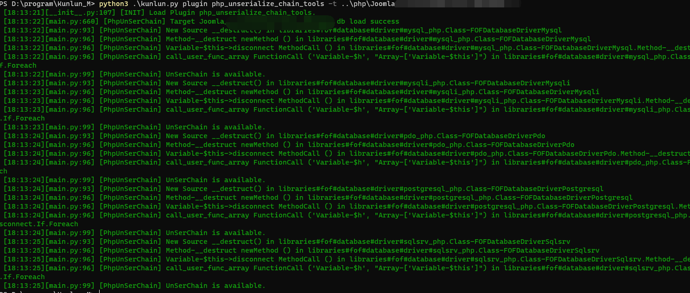

# 插件 phpunserializechain

基于.QL概念探索出了一套简单的codedb

基于这套Codedb完成了一个自动化寻找php反序列化链的简单模型，目前还没有完全解决所有在完成过程遇到的问题。

欢迎issue :>.

## Usage

```
python3 .\kunlun.py plugin php_unserialize_chain_tools -t {target_path}
```

如果发现完整反序列化链，插件会自动生成：

- `php_unserialize_chain_summary.json`：完整链路信息（类、方法、节点）
- `chain_XX.php`：每条链一个 PoC（例如扫描到 3 条链就生成 3 个文件）
- `poc_all_chains.php`：批量执行所有 `chain_XX.php` 的入口脚本

`chain_XX.php` 中会优先使用递归分析阶段保存的层级关系（`recursive_relations`）与属性信息（`analysis_properties`）来构造对象图和可控参数；当信息不足时，再回退到节点属性路径提取（如 `$this->a->b`）与 `next` 兜底策略。

对于隐式触发链（如 `__toString` / `__call` / `__wakeup` / `__invoke`），生成脚本会附带对应触发语法，避免只覆盖 `__destruct` 场景。

默认输出目录：`{target_path}/.kunlunm_unserialize_poc/`

也可以通过 `-o` 自定义输出目录：

```
python3 .\kunlun.py plugin php_unserialize_chain_tools -t {target_path} -o /tmp/unser_poc
```

## tests


