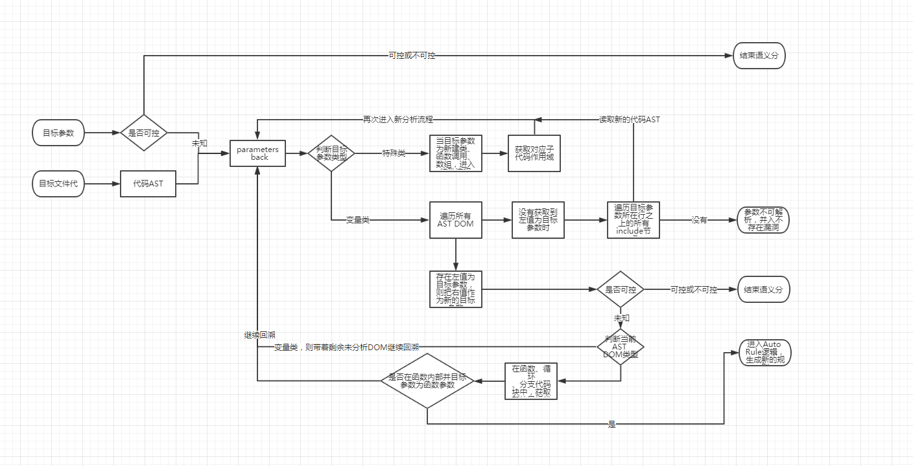

# Cobra-W开发文档


## 开始

使用-h可以查看使用帮助

```
python .\cobra.py -h

usage: cobra [-h] [-t <target>] [-f <format>] [-o <output>] [-r <rule_id>]
             [-b BLACK_PATH] [-d] [-u]

  ____      _                  __        __
 / ___|___ | |__  _ __ __ _    \ \      / /
| |   / _ \| '_ \| '__/ _` |    \ \ /\ / /
| |__| (_) | |_) | | | (_| | --- \ V  V /
 \____\___/|_.__/|_|  \__,_|      \_/\_/  v1.9.1

GitHub: https://github.com/LoRexxar/Cobra-W

Cobra is a static code analysis system that automates the detecting vulnerabilities and security issue.

optional arguments:
  -h, --help            show this help message and exit

Scan:
  -t <target>, --target <target>
                        file, folder, compress, or repository address
  -f <format>, --format <format>
                        vulnerability output format (formats: html, json, csv,
                        xml)
  -o <output>, --output <output>
                        vulnerability output STREAM, FILE
  -r <rule_id>, --rule <rule_id>
                        specifies rules e.g: 1000, 1001
  -s <secret_name>, --secret <secret_name>
                        secret repair function e.g: wordpress
  -i <sid>, --sid <sid>
                        sid for cobra-wa
  -l <log>, --log <log>
                        log name for cobra-wa
  -lan LANGUAGE, --language LANGUAGE
                        set target language
  -b BLACK_PATH, --blackpath BLACK_PATH
                        black path list
  -d, --debug           open debug mode
  -u, --unconfirm       show unconfirmed vuls

Usage:
  python cobra.py -t tests/vulnerabilities
  python cobra.py -t tests/vulnerabilities -r 1000, 1001
  python cobra.py -t tests/vulnerabilities -s wordpress
  python cobra.py -t tests/vulnerabilities -f json -o /tmp/report.json
  python cobra.py -t tests/vulnerabilities --debug
  python cobra.py -t tests/vulnerabilities -d -u
  python cobra.py -t tests/vulnerabilities --lan php -b vendor --debug
```

## 核心代码

整个核心代码的运行逻辑：

```
__init__.py -> cli.py主线程 -> until.py加载规则库 -> detection.py 判断扫描对象的语言和框架 -> engine.py(scan) 启动扫描 -> cast.py ast -> parser.py ast分析 -> engine.py 整理结果 -> export.py 导出结果
```

- init.py：  参数的解析和对应配置
- cli.py:    开始扫描前的一些预处理
- cast.py:   ast中预处理的一些代码，如匹配函数获取变量名
- config.py: 一些配置文件目录的配置
- const.py:  一些常量的配置
- engine.py: 扫描主逻辑，处理扫描已经扫描结果处理
- export.py: 扫描结果的处理
- file.py:   底层文件操作的处理
- log.py:    log日志配置
- parser.py  AST核心文件
- rule.py    规则处理文件

## 规则模块

规则目录结构为
```
rules/{语言类型}/CVI_xxxx.py
```

在规则目录下，只有命名符合规定的规则会被成功加载，命名格式严格为`CVI_编号.py`

规则默认格式为
```
# -*- coding: utf-8 -*-

"""
    CVI-1000
    ~~~~

    Reflected XSS

    :author:    LoRexxar <LoRexxar@gmail.com>
    :homepage:  https://github.com/LoRexxar/cobra
    :license:   MIT, see LICENSE for more details.
    :copyright: Copyright (c) 2017 LoRexxar. All rights reserved
"""


class CVI_1000():
    """
    rule class
    """

    def __init__(self):

        self.svid = 1000
        self.language = "PHP"
        self.author = "LoRexxar/wufeifei"
        self.vulnerability = "Reflected XSS"
        self.description = "Reflected XSS"

        # status
        self.status = True

        # 部分配置
        self.match_mode = "function-param-regex"
        self.match = "echo|print|print_r|exit|die|printf|vprintf|trigger_error|user_error|odbc_result_all|ovrimos_result_all|ifx_htmltbl_result"

    def main(self, regex_string):
        """
        regex string input
        :regex_string: regex match string
        :return:
        """
        pass

```

**规则类必须和文件名相同，否则规则库会加载无效**

init里为规则的一部分设置
- svid: 规则编号
- language： 语言类型（会和扫描对象向匹配，使用对应的规则脚本）
- author: 规则作者
- vulnrability: 漏洞类型
- description: 漏洞描述
- statu: 表示是否开启该规则
- match_mode: 规则匹配方法（下面详解）
- match: 敏感函数正则，漏洞语句正则


### 规则匹配类型

暂时把规则匹配方法分为三类：

- only-regex
纯正则匹配，符合正则的点会直接被判定为漏洞点，不进入任何参数分析等...一个非常特殊的匹配模式。

- function-param-regex
函数正则匹配，通过匹配敏感函数来判断漏洞点，然后敏感函数中的所有变量会进入AST分析流程，如果匹配到其中参数可控，就会被判定为漏洞点。

- vustomize-match
自定义匹配，先通过正则匹配漏洞存在点，然后进入自定义的参数解析函数(规则中的main函数)，自定义解析到目标参数**列表**，返回进入ast分析，回溯可控变量。


## 语法分析部分

语法分析的代码主要集中在case.py和parser.py两个文件，case主要负责处理AST的前期准备（参数确认）和AST分析后的结果处理。 

核心的语法分析主要是parser.py。

整个分析过程依赖python的phply模块作语法分析，代码主要是对分析结果做处理。

```
test_single_file.php

<?php
include("test1.php");
include "test2.php";


# 不可控
$url = "phpinfo()";
eval($url);

# 可控
$url = $_GET['a'];
eval($url);

# 可控
eval($url2);

# 不可控
eval($url3);

# 经过一次
$url4 = $test;
eval($url4);

# 函数
 function test(){
     return $_GET['a'];
 }

$url5 = test();
eval($url5);


$a = 1;
if(a == 1){
    eval($url4);
}
```

上面的代码会被解析成相应的节点

```
Include('test1.php', False)
Include('test2.php', False)
Assignment(Variable('$url'), 'phpinfo()', False)
Eval(Variable('$url'))
Assignment(Variable('$url'), ArrayOffset(Variable('$_GET'), 'a'), False)
Eval(Variable('$url'))
Eval(Variable('$url2'))
Eval(Variable('$url3'))
Assignment(Variable('$url4'), Variable('$test'), False)
Eval(Variable('$url4'))
Function('test', [], [Return(ArrayOffset(Variable('$_GET'), 'a'))], False)
Assignment(Variable('$url5'), FunctionCall('test', []), False)
Eval(Variable('$url5'))
Assignment(Variable('$a'), 1, False)
If(BinaryOp('==', Constant('a'), 1), Block([Eval(Variable('$url4'))]), [], None)
```
节点列表会用倒序的方式逐步回溯目标变量，从这里开始不同的规则模式就需要不同的回溯方式了。

###  function-param-regex

function-param-regex采用的是类似于正向分析的逻辑。

从`parser.py 1383行`的`scan_parser`函数进入，调用phply的parser的来分析当前代码文件的ast树，然后进入analysis函数进入不同的处理函数。


```
def analysis(nodes, vul_function, back_node, vul_lineo, file_path=None, function_params=None):
    """
    调用FunctionCall-->analysis_functioncall分析调用函数是否敏感
    :param nodes: 所有节点
    :param vul_function: 要判断的敏感函数名
    :param back_node: 各种语法结构里面的语句
    :param vul_lineo: 漏洞函数所在行号
    :param function_params: 自定义函数的所有参数列表
    :param file_path: 当前分析文件的地址
    :return:
    """
    buffer_ = []
    for node in nodes:
        if isinstance(node, php.FunctionCall):  # 函数直接调用，不进行赋值
            anlysis_function(node, back_node, vul_function, function_params, vul_lineo, file_path=file_path)

        elif isinstance(node, php.Assignment):  # 函数调用在赋值表达式中
            if isinstance(node.expr, php.FunctionCall):
                anlysis_function(node.expr, back_node, vul_function, function_params, vul_lineo, file_path=file_path)

            if isinstance(node.expr, php.Eval):
                analysis_eval(node.expr, vul_function, back_node, vul_lineo, function_params, file_path=file_path)

            if isinstance(node.expr, php.Silence):
                buffer_.append(node.expr)
                analysis(buffer_, vul_function, back_node, vul_lineo, file_path, function_params)

        elif isinstance(node, php.Print) or isinstance(node, php.Echo):
            analysis_echo_print(node, back_node, vul_function, vul_lineo, function_params, file_path=file_path)

        elif isinstance(node, php.Silence):
            nodes = get_silence_params(node)
            analysis(nodes, vul_function, back_node, vul_lineo, file_path)

        elif isinstance(node, php.Eval):
            analysis_eval(node, vul_function, back_node, vul_lineo, function_params, file_path=file_path)

        elif isinstance(node, php.Include) or isinstance(node, php.Require):
            analysis_file_inclusion(node, vul_function, back_node, vul_lineo, function_params, file_path=file_path)

        elif isinstance(node, php.If):  # 函数调用在if-else语句中时
            analysis_if_else(node, back_node, vul_function, vul_lineo, function_params, file_path=file_path)

        elif isinstance(node, php.While) or isinstance(node, php.For):  # 函数调用在循环中
            if isinstance(node.node, php.Block):
                analysis(node.node.nodes, vul_function, back_node, vul_lineo, file_path, function_params)

        elif isinstance(node, php.Function) or isinstance(node, php.Method):
            function_body = []
            function_params = get_function_params(node.params)
            analysis(node.nodes, vul_function, function_body, vul_lineo, function_params=function_params, file_path=file_path)

        elif isinstance(node, php.Class):
            analysis(node.nodes, vul_function, back_node, vul_lineo, file_path, function_params)

        back_node.append(node)
```
当分析过程中获取到与敏感函数相同的函数调用时，把所选位置的代码以及变量传入`anlysis_params`函数中，进入语义分析。

### vustomize-match

vustomize-match自定义匹配和函数匹配有一点儿不同，vustomize-match的基础在于正则表达式，正则表达式的匹配不依赖任何的语义，所以从漏洞扫描的第一步就非常的依赖正则表达式的精度。

如果正则表达式写的足够好，可以在第一时间就节省很多不必要的麻烦。

`cast.py 241行`，当正则表达式匹配到相应的语句是，将会读取该文件的文件内容，以及匹配到相应的参数，传入`anlysis_params`中。

```
_is_co, _cp, expr_lineno = anlysis_params(param_name, param_content, self.file_path, self.line, self.sr.vul_function, self.repair_functions)
```
同样的，经过一定程度的处理，进入语义分析。

### 递归语义分析

`deep_parameters_back`和`parameters_back`是两个设计为递归分析语义树的函数，deep主要负责跨文件的判断，另外一个主要是负责一个代码块中的回溯分析。

调用`deep_parameters_back`进入深度递归回溯变量。

递归过程主要是`parameters_back`函数，仍然是倒序寻找变量赋值语句，然后左值保留，右值作为可控变量再次进入`parameters_back`函数。

语义分析的核心就在于这个函数`parameters_back`，在这里通过多种语句，分割不同的代码子块，再次递归分析代码。



在整个递归逻辑上，判断的唯一条件就是，目标参数是否为可控或者不可控，只有在得到确认的变量时，就可以从递归中退出。

```
controlled_params = [
  '$_GET',
  '$_POST',
  '$_REQUEST',
  '$_COOKIE',
  '$_FILES',
  # '$_SERVER', # 暂时去掉了，误报率太高了
  '$HTTP_POST_FILES',
  '$HTTP_COOKIE_VARS',
  '$HTTP_REQUEST_VARS',
  '$HTTP_POST_VARS',
  '$HTTP_RAW_POST_DATA',
  '$HTTP_GET_VARS' ]
```

经过一系列的语义分析之后，目标参数会带着相应的参数类型返回结果

```
if result[0]['code'] == 1:  # 函数参数可控
  return True, 'Function-param-controllable'   
if result[0]['code'] == 2:  # 漏洞修复
  return False, 'Function-param-controllable but fixed'   
if result[0]['code'] == -1:  # 函数参数不可控
  return False, 'Function-param-uncon'   
if result[0]['code'] == 4:  # 新规则生成
  return False, 'New Core', result[0]['source']
```
除了上面的几个以外，还有一个`code == 3`，为该参数不确定是否可控，一般当code为3是返回了结果，代表语义分析完成时，仍然没得到确认的结果，无法判断是否为漏洞。

当`code == 4`的时候，就会进入一个特殊的逻辑中，auto rule机制

### auto rule机制

Auto rule机制是一个Cobra-W中新加的特有机制，当敏感函数的调用在函数中，而敏感函数回溯变量的结果为，从函数参数中获取，那么我就会把这个函数作为新的rule进行下一次扫描，类的扫描同理，区别是要从析构函数中读取函数参数。

为了能够实现，新的auto rule不影响原有的漏洞扫描，仅在中间部分添加一次扫描，并可以实现递归生成新的auto rule，我把auto rule的入口点添加在了`SingleRule 的process`中调用Core的地方，将所有auto rule的返回结果和Core原本的返回结果拼接起来合并返回。

```
new_rule_vulnerabilities = NewCore(self.sr, self.target_directory, data, self.files, 0, secret_name=self.secret_name)

if len(new_rule_vulnerabilities) > 0:
    self.rule_vulnerabilities.extend(new_rule_vulnerabilities)
```
auto rule的第一步是生成新的正则规则，当我们获取到危险函数时，我们进一步匹配函数调用点，然后还需要去除函数定义的部分。

engine.py 678行
```
match = "(?:\A|\s)" + function_name + "\s*\("

match2 = "function\s+" + function_name
```
类相关的比较简单
```
match = "new\s*" + class_name + "\s*\("

match2 = "class\s+" + class_name + "\s*{"
```

### secret机制

除了正向的深化递归分析以外，我们还常常遇到一种情况。

很多CMS在处理代码的安全问题时，面临的特殊情况比较多，所以单纯的自带过滤函数没办法满足多种情况的需求，所以CMS一般都有自建的安全过滤函数，其中很多过滤函数甚至都不会使用到常用的过滤函数。

在人来完成的代码分析时，我们可以很容易的把这些无法被绕过的安全过滤函数作为这个漏洞不成立的条件，但是自动分析的代码却做不到，于是我引入了secret机制，通过人来设定一些特有的过滤函数，这样一来大幅度减少了误报率。

```
rules/secret/wordpress.py
wordpress
   ~~~~
   secret for wordpress 
   :author:    LoRexxar <LoRexxar@gmail.com> 
   :homepage:  https://github.com/LoRexxar/cobra 
   :license:   MIT, see LICENSE for more details. 
   :copyright: Copyright (c) 2017 LoRexxar. All rights reserved 
"""   
wordpress = {
  "esc_url": [1000, 10001],
  "esc_js": [1000, 10001],
  "esc_html": [1000, 10001],
  "esc_attr": [1000, 10001],
  "esc_textarea": [1000, 10001],
  "tag_escape": [1000, 10001],
  "esc_sql": [1004, 1005, 1006],
  "_real_escape": [1004, 1005, 1006], 
}
```
**secret字典必须和文件名相同，否则会加载无效**

相应的函数名，会在`parser.py 257行`进行判断，过滤相应的结果

```
def is_repair(expr):
	"""
	 判断赋值表达式是否出现过滤函数，如果已经过滤，停止污点回溯，判定漏洞已修复  
	:param expr: 赋值表达式  
	:return:
	 """  
    is_re = False # 是否修复，默认值是未修复
    global is_repair_functions
      if expr in is_repair_functions:
          logger.debug("[AST] function {} in is_repair_functions, The vulnerability does not exist ")
          is_re = True
    return is_re
```